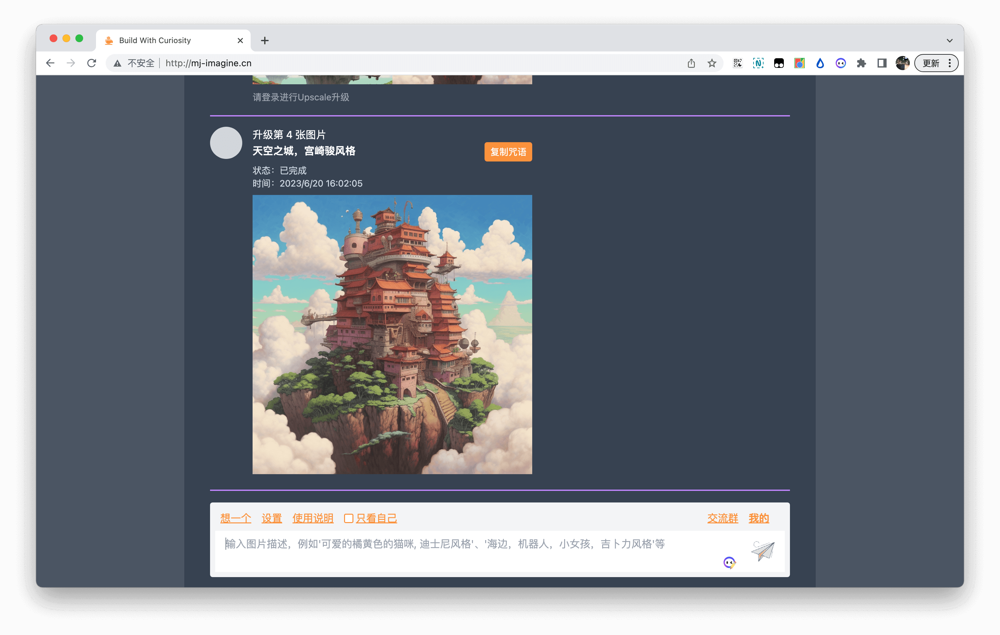
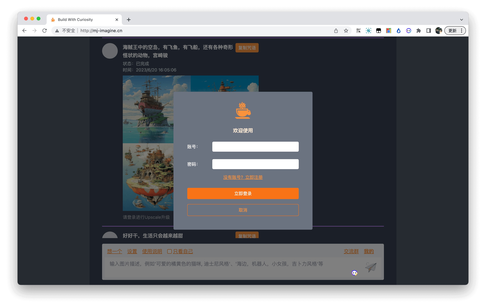
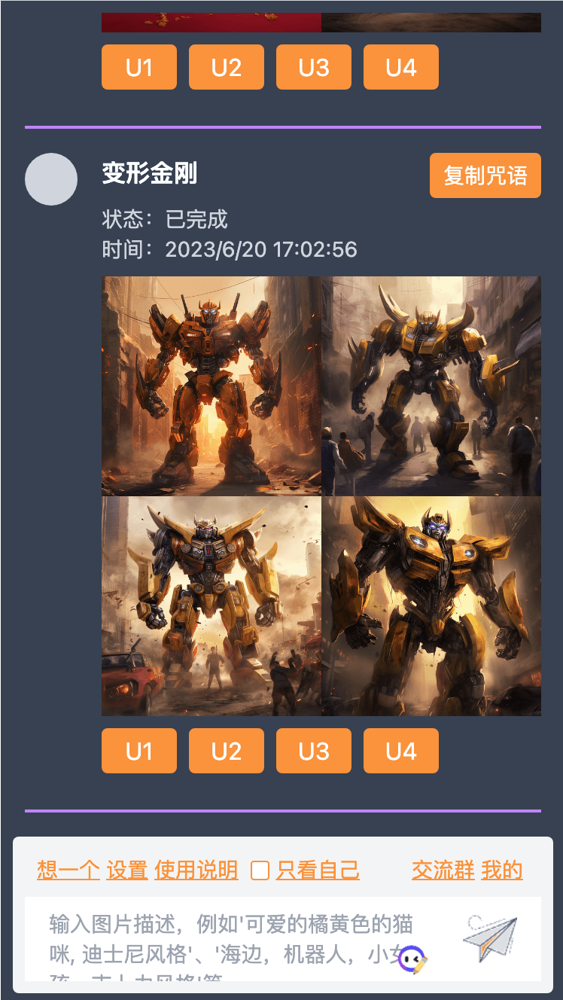

# Midjourney Server Web

基于[midjourney-client](https://github.com/erictik/midjourney-client)的api开发的后端项目，前台可视化界面在这里[https://github.com/rictt/midjourney-ui-vue3](https://github.com/rictt/midjourney-ui-vue3)

## 在线体验/反馈(已过期)
- [体验地址：http://mj-imagine.cn/](http://mj-imagine.cn/)
- [其他交流，反馈问题](#页面截图)

## 技术栈

  大部分都是nest的官方包，还有周边生态的主流应用，比如mysql，typeorm等

- 应用框架：nestjs
- 鉴权：jwt、redis、passport、passport-jwt
- 数据库操作：typeorm、mysql2
- Midjourney代理：midjourney
- websocket：socket.io
- 定时任务：@nestjs/schedule

## 已完成功能/模块
- [x] 用户登录/注册模块
- [x] 中文prompt翻译
- [x] 常见敏感词过滤（非mj敏感词集）
- [x] 定时更新任务状态
- [x] 任务队列管理绘画
- [x] websocket处理绘画进度

## Todo/计划
- [] 不维护了

## 页面截图
   

   

   
